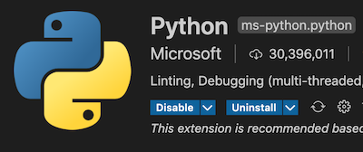
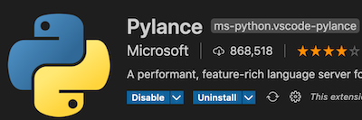
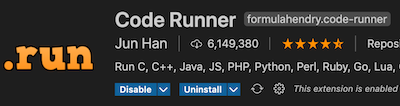
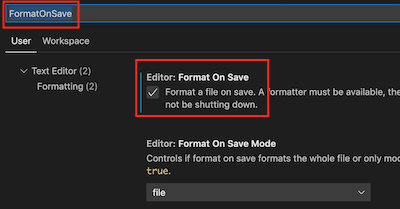
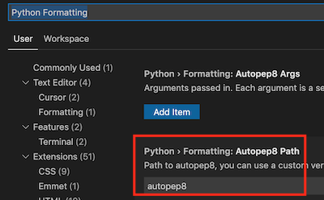

# Python 入門

## 環境安裝

- windows : <https://www.python.org/downloads/>
- mac os :
install HomeBrow : <https://brew.sh/index_zh-tw>

```bash
# 透過 HomeBrew 安裝 python
$ brew install python3
```

### pip 指令

- python 已帶 pip 指令
- 如電腦同時安裝 python2/python3 ，要使用 python3 需，指令改用 `pip3`
- pip 常用指令

```bash
# pip 常用指令
$ pip3 install 套件名稱   # 安裝套件
$ pip3 uninstall 套件名稱 # 移除套件
$ pip3 install --upgrade 套件名稱  # 升級套件
$ pip3 show 套件名稱 # 顯示套件相關資訊
```

## 開發工具(IDE)

- VS Code

  下載並安裝 VSCode : <https://code.visualstudio.com/download>

  - extensions :

    Python Extension : 讓 VS Code 支援 Python 語法提示

    

    Pylance Extension : 調整 LanguageServer 為 Pylance (比預設Python extension有更好的支援)

    

    Code Runner : 快速在 VS Code 裡執行 Python 程式

    

  - 安裝 extension 必要套件
    於 extension 安裝完後，第一次啟用時，會提示安裝，或則自行透選 pip 套件安裝

    ```docs
    autopep8
    pylint
    ```

  - 設定直譯器

    - 按「ctrl+shift+p」(mac : cmd+shift+p) 後輸入「python」，選擇「python: Select Interpreter」，然後選擇 Python安裝的版本
    - 如電腦有多版本的Python ，可設定 Code Runer 使用指定的版本:

      按「ctrl+shift+p」(macos: cmd+shift+p」後輸入「settings」，選擇「Preference:Open Settings(JSON)，在 settings.json加入以下內容，以確保使用的是安裝的 Python版本執行

      ```JSON
      "code-runner.executorMap": {
        "python": "$pythonPath -u $fullFileName"
      }
      ```

  - 自動格式化設定: FormatOnSave

    VS Code > Preferences > Settings > 輸入「FormatOnSave」

    

    VS Code > Preferences > Settings > 輸入「Python Formatting」

    

## Python 摘要

### Code Style

- [pep8](https://www.python.org/dev/peps/pep-0008/)
- 4個空格當縮排
- Class : UpperCamelCase
- Function/Vaiables : lowercase_with_underscores


### 資料型別

Data Type | Example
----------|--------------------
str | x = "Hello World"
int | x = 20
float | x = 20.5
complex | x = 1j
list | x = ["apple", "banana", "cherry"]
tuple | x = ("apple", "banana", "cherry")
range | x = range(6)
dict | x = {"name" : "John", "age" : 36}
set | x = {"apple", "banana", "cherry"}
frozenset | x = frozenset({"apple", "banana", "cherry"})
bool | x = True
bytes | x = b"Hello"
bytearray | x = bytearray(5)
memoryview | x = memoryview(bytes(5))

#### 資料型別轉換

函式 | 功能
----|-------------------------
int() | 數值字串轉換為整數型別
float() | 數值字串轉換為浮點型別
str() | 數值型別轉換為文字型別

### 變數

- 不需特別宣告，型別依內容自動指定 （弱型別)

- 「del」關鍵字，可刪除變數或集合裡的內容

- 「type()」函式，可取得變數型別

### 範例

- [判斷式](./example/condition.py)
- [迴圈](./example/loop.py)
- [continue、break、pass](./example/loop-advanced.py)
- [function(函式)](./example/function.py)
- [function 關鍵字參數](./example/function-keyword-param.py)
- [anonymous function(lambda)](./example/lambda.py)
- [class](./example/class.py)
- [可直接使用的內建函式](https://docs.python.org/zh-tw/3.9/library/functions.html)
- [Error Handler](./example/error-handler.py)
- [引用模組](./example/import.py)
- [內建模組 1](https://docs.python.org/zh-tw/3/tutorial/stdlib.html)
- [內建模組 2](https://docs.python.org/zh-tw/3/tutorial/stdlib2.html)
